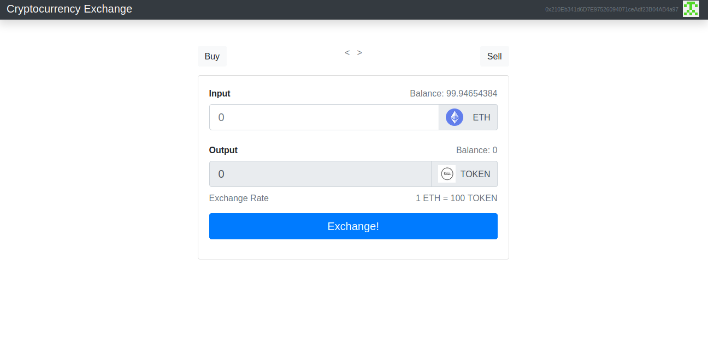

# Cryptocurrency-Exchange
A centralised cryptocurrency exchange Dapp built upon the ethereum blockchain to exchange ethers for a demo token. The Dapp performs exchange with a demo token built using ERC-20 standard and performs the exchanges using public etherum addresses and wallets.
## Running Steps
* Clone the repository
* Truffle migrate
* npm install
* npm run start
## Screenshot

## Smart Contracts
* ERC-20 Token Smart Contract
* Ethereum Swap
## Technologies Used
* React JS
* Bootstrap
* Solidity
* Ganache
* Truffle
## References
* [ERC- 20 Token](https://ethereum.org/en/developers/docs/standards/tokens/erc-20/)
* [DAPP University ETH Swap](https://github.com/dappuniversity/eth_swap)

